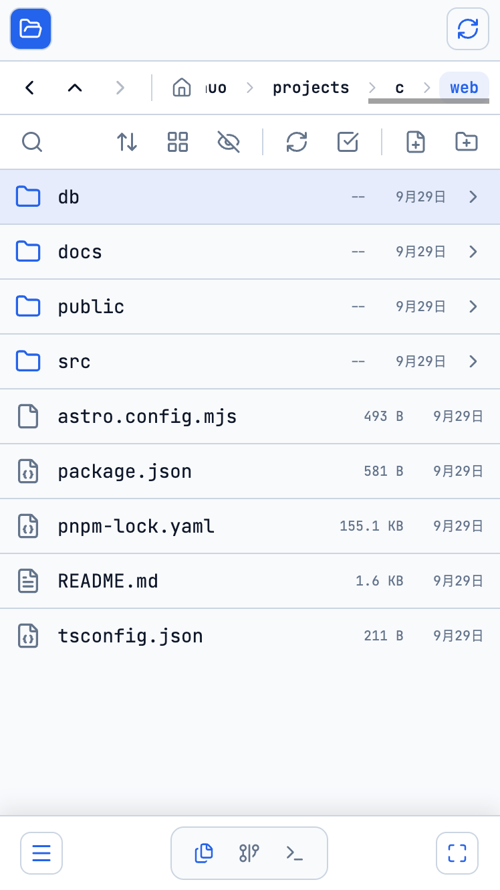
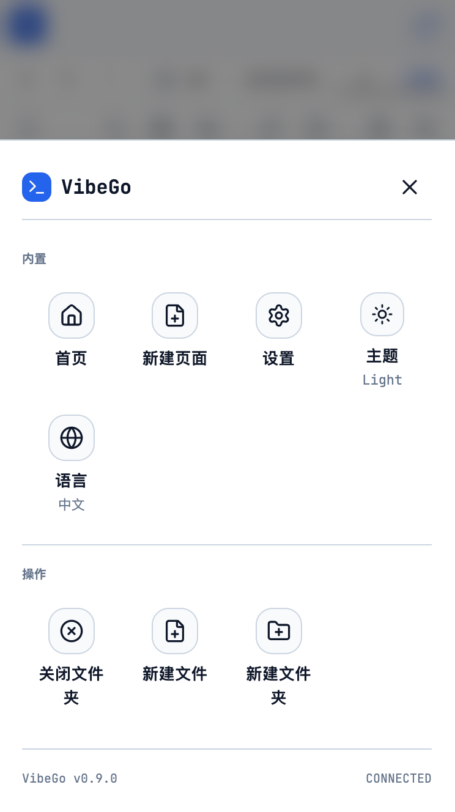
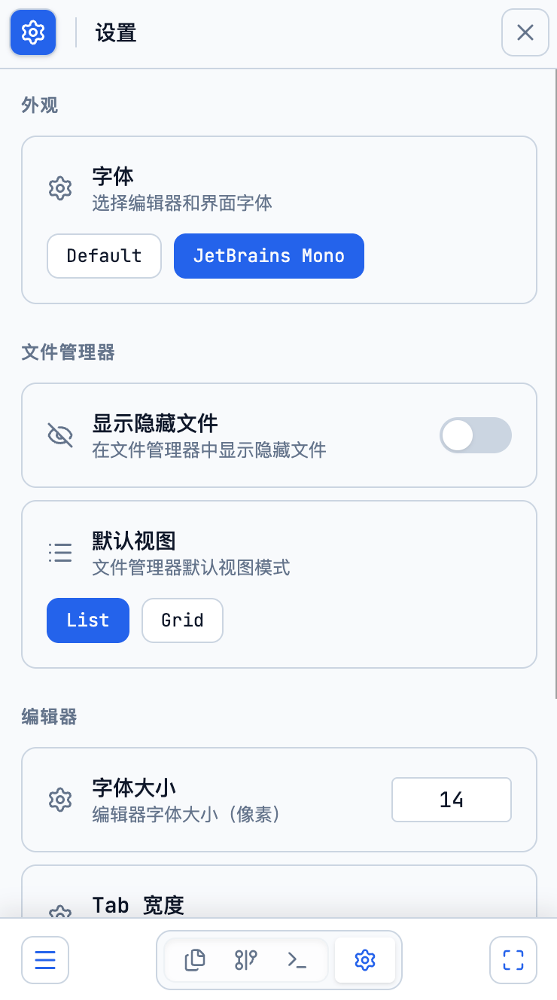
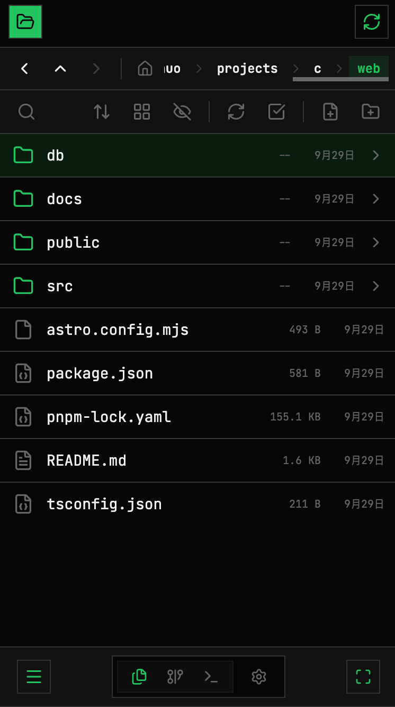
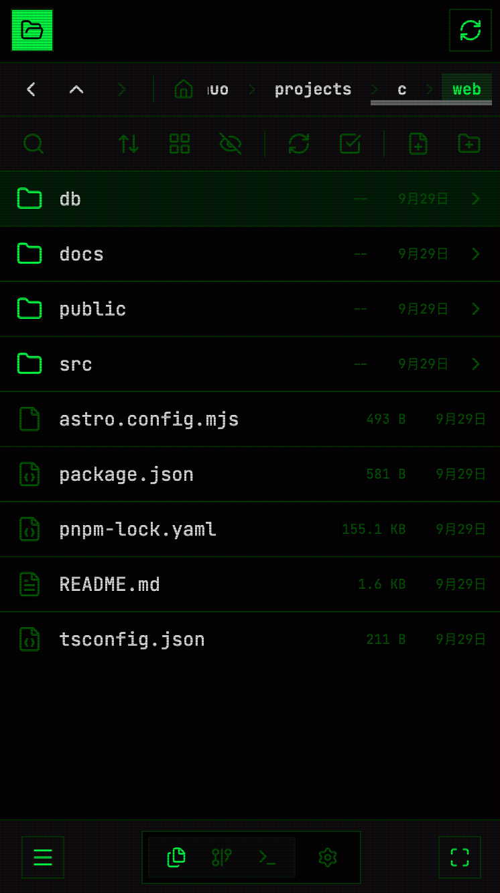

# VibeGo

A Web IDE built for professionals, designed for Vibe Coding anytime, anywhere. Freely use your Claude Code, Gemini CLI, CodeX, OpenCode, and more.

为专业人士打造，支持随时随地 Vibe Coding 的 Web IDE。 自由使用你的 Claude Code、Gemini CLI、CodeX、OpenCode 及更多工具。

## Preview

  
  
  

  
  

  
  

