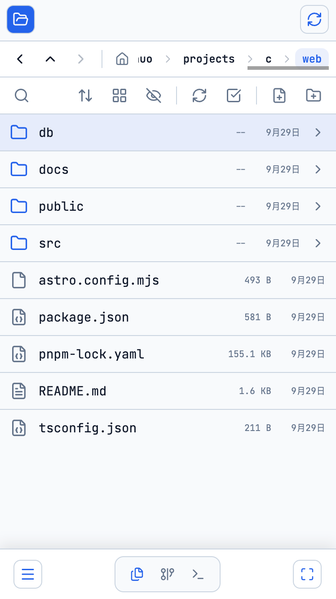
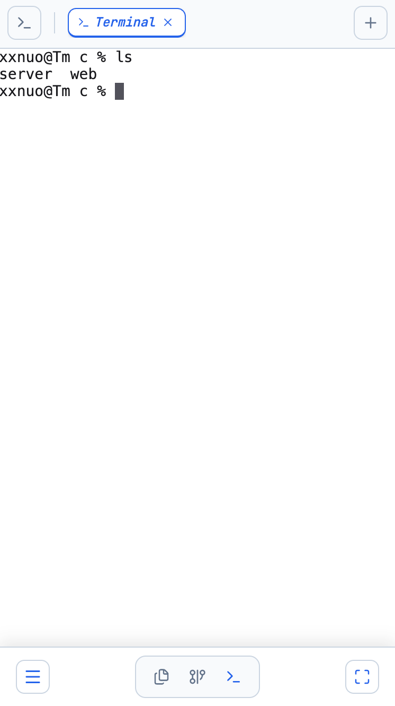
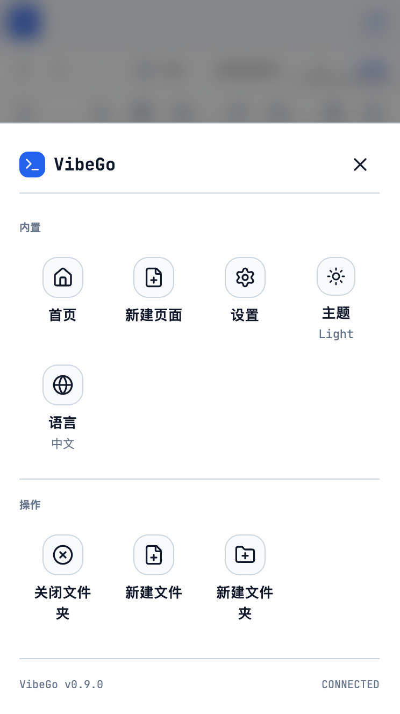
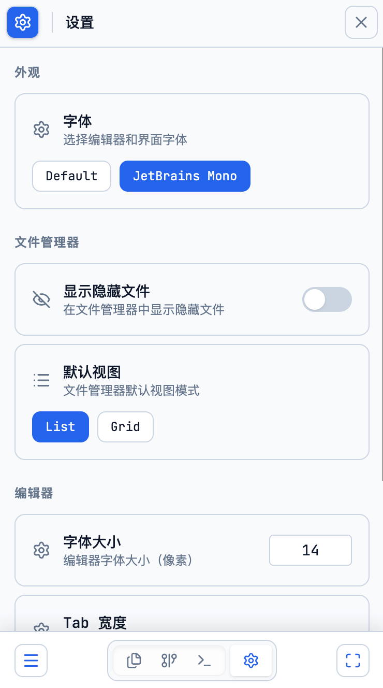
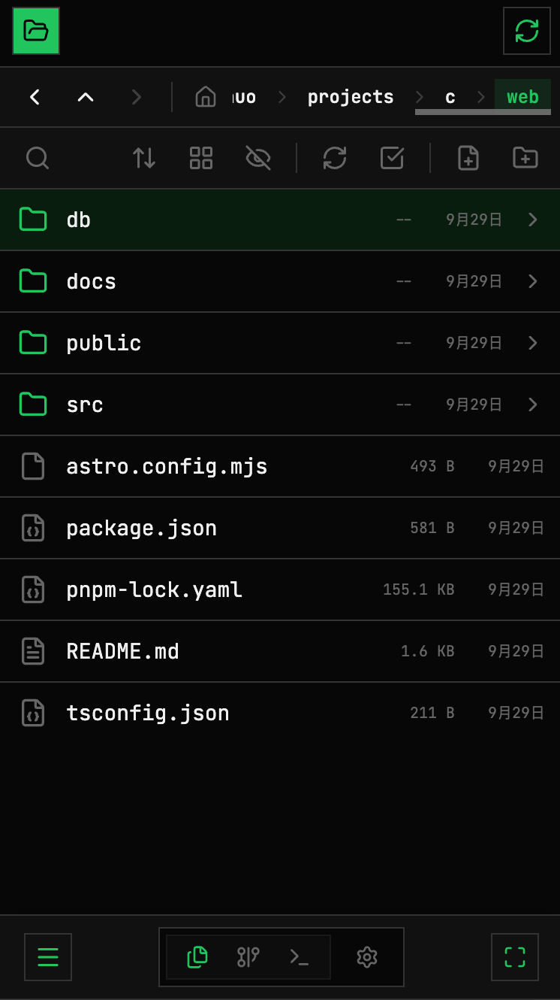

# VibeGo

[中文](README.zh-CN.md) | English

A browser-based coding workspace for Vibe Coding anywhere. Connect back to your own machine, open the files you need, run the CLI tools you trust, and keep coding from wherever you are.

VibeGo is designed mobile-first, but it also works well on tablets and desktop-sized screens. It keeps the interface light, direct, and comfortable across devices, while leaving you free to use Claude Code, Gemini CLI, Codex, OpenCode, and any other terminal-native workflow.

The product is intentionally centered on three essentials: Files, Git, and Terminal. Around them, VibeGo also provides optional tool pages that you can open when needed, so the workspace can grow without turning into a heavy, fixed interface.

## Preview

<p align="center">
  
  
  
</p>

<p align="center">
  
  
  
</p>

## Quick Start

In active development. Experience the beta version directly via npx without manual installation:

```bash
npx -y vibego@latest
```

Or using pnpm:

```bash
pnpm dlx vibego@latest
```

By default, VibeGo starts at `http://localhost:1984`.

## Features

- **Files:** Browse, edit, and organize project files with syntax highlighting, file tree management, and quick navigation.
- **Terminal:** Run real shell sessions in the browser, with vertical and horizontal split panes for AI CLIs, build tools, dev servers, and long-running tasks.
- **Git:** Review status and diffs, commit, push, pull, force push, and manage branches or merges from a compact Git interface.
- **Custom Pages:** Open additional pages for AI session browsing, BlockTerm, process monitoring, port management, remote control, remote desktop, and keyboard testing. Page entries can be shown or hidden from the New Page menu.
- **Anywhere UI:** A responsive interface for phones, tablets, and large desktop screens, with dark/light modes and customizable themes, built for quick checks as well as real work.
- **Secure Access:** Built-in authentication, LAN access controls, and rate limiting (Fail2ban) to protect your remote coding entry point.

## Install

Install and update VibeGo globally via npm:

```bash
npm i -g vibego@latest
```

Or using pnpm:

```bash
pnpm i -g vibego@latest
```

Start the application:

```bash
vibego
```

## Configuration

You can configure VibeGo's behavior using command-line arguments or environment variables (prefixed with `VG_`):

- `-p, --port` / `VG_PORT`: Specify the listening port (default: `1984`).
- `--host` / `VG_HOST`: Define the server host address (default: `0.0.0.0`).
- `-k, --key` / `VG_KEY`: Set an access key. If omitted, WAN access is strictly disabled for security.
- `--need-key` / `VG_NEED_KEY`: Enforce key authentication even on local networks. Automatically enforced if `--allow-wan` is used with a valid `--key`.
- `-a, --allow-wan` / `VG_ALLOW_WAN`: Enable WAN access. **Note:** Requires a valid access key.
- `--shell` / `VG_SHELL`: Default shell executable for terminal sessions.
- `--log-level` / `VG_LOG_LEVEL`: Log level (`debug`, `info`, `warn`, `error`).

## The Origin Story

I've had the idea for this project for a long time: AI coding should not be locked to one desk, one device, or one prescribed interface. The most important thing is not to recreate every development feature in the browser, but to make your existing machine, repository, and command-line tools reachable from anywhere.

I've also used many feature-heavy AI Agent tools on the market (such as vibe-kanban, coolvibe, and the web version of opencode):

They are either too complex and heavy, making them hard to learn and slow to keep up with the rapid iteration of official CLIs, or they hand over complete control to the AI and isolate the human from the code. Current AI still needs a human close to the files, diffs, and terminal, otherwise it can easily generate unmaintainable "spaghetti code."

Official model providers already offer GUI interfaces, so I chose not to wrap the CLIs into another standard chat surface. VibeGo keeps the terminal as a first-class space because that is where users have the most freedom: choose any model CLI, any script, any local tool, and any workflow.

AI tasks often take time. You may start something at your desk, then need to check progress, review a diff, fix a file, inspect a process, forward a port, or restart a command while away from the computer. That is why cross-device optimization became a priority: VibeGo is meant to let you keep programming smoothly on phones, tablets, desktops, and across fragments of time.

Finally, it's a personal pursuit. I have always admired Apple's design philosophy: a software must be minimalist and intuitive to be a great tool. Because the interface prioritizes aesthetics and intuition, other complex features are deprioritized. I encourage you to click around everywhere—you'll discover some clever little design touches!

Since setting the design goals, I've been continuously refining it. Developed intermittently in my spare time during a busy work schedule, the design is now polished, and the core features are complete. There might still be a few bugs in the Git operations, but feel free to dive in, report issues, and contribute your ideas and code!
